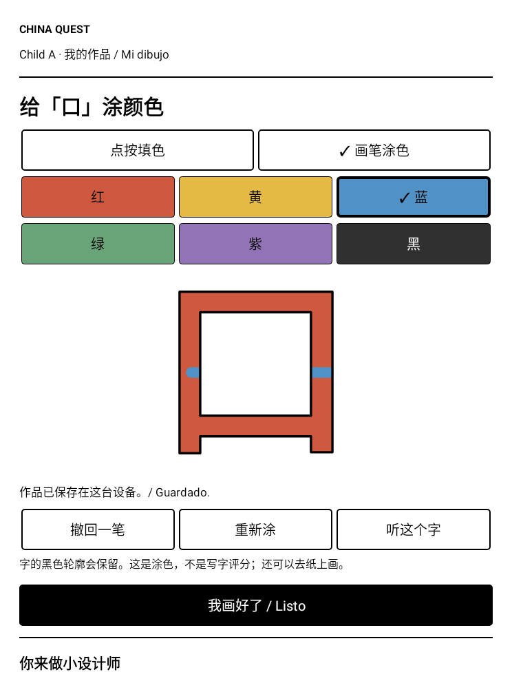
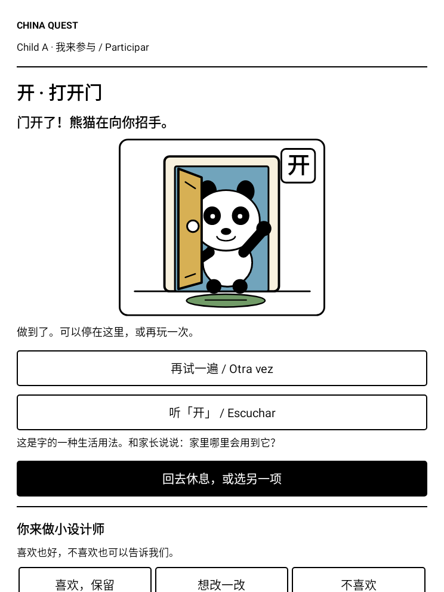

# China Quest · 我的中国远征 · Misión China

**Learn · Create · Explore — 学习 · 创造 · 探索**

一个让家长和孩子一起使用的中文学习项目：每天学一点汉字，记一记、说一说，在纸上写，在生活里用，也可以给汉字涂色、参与小情景。

它希望成为家庭长期学习的伙伴。中国旅行可以是一个里程碑，学习和创造还会继续。

**[下载 Android APK](https://github.com/leslietan19000/china-quest/releases/download/v0.3.0-preview/ChinaQuest-0.3.0-preview.apk)** · **[安装说明](docs/INSTALL.md)** · **[版本发布页](https://github.com/leslietan19000/china-quest/releases/tag/v0.3.0-preview)**

> 当前是 **0.3.0-preview 家庭试用版**。需要 Android 8.0 或以上，没有 iPhone / iPad 版本。优先面向 BOOX Nova Air C；本版的实际颜色、笔延迟和残影尚待真机反馈，其他 Android 设备未经系统测试。

## 现在可以做什么

- **两个独立孩子档案**：各自保存进度、起点和作品，没有兄弟排行榜。家长可以改称呼。
- **按已有基础开始**：家长勾选已经认识的字，后续新课程跳过这些字，并安排少量抽查。默认每天五个新字，可以调整目标、暂停新字或只复习。
- **认字、复习、用词**：178 个有来源的基础汉字、353 条常用词记录、认字选择题、朗读与纸笔自评，以及有限的用词表达任务。
- **点按听读**：469 条打包在 APK 内的离线中文合成音频，字和词可以分别点按听。不录音，不自动判断发音。
- **给汉字涂色**：六种颜色，点按填色或画笔涂色，支持撤回和本机保存；涂色不代替纸笔写字。
- **自己参与情景**：“口／吃”吃苹果，“开／关”开关门，“水／喝”拿杯喝水。每次点按前进一步，不自动播放。
- **家长空间**：PIN 保护的本机设置与进度查看。孩子可以对新功能选“喜欢／想改／不喜欢”。

| 给汉字涂颜色 | 点按打开门 |
|---|---|
|  |  |

*上图是自动化测试生成的界面，使用虚构档案，不是儿童照片或 BOOX 实拍。*

## 给第一次安装的朋友

1. 在 Android 设备上下载上面的 **APK 文件**，不要下载 GitHub 的 “Source code” 压缩包来安装。
2. 在文件管理器中打开 APK，按系统提示安装。首次打开由家长设置自己的 **6–12 位 PIN**，没有默认密码。
3. 选择一个孩子；如果题目太容易，点“这些字太容易？请家长调整起点”，筛选已认识的字。
4. 准备纸笔，开始学习。想涂色或试互动情景，可进入“创作小工坊”。断网也能使用。

**旧版用户直接覆盖更新，保留原 PIN；不要卸载或清除数据。** 详细步骤、设备说明与常见问题见 [安装指南](docs/INSTALL.md)。

## 家庭使用方式与隐私

目标是每天约 10–15 分钟主动使用设备，配合纸笔、读书、说话与真实生活任务；不是强迫孩子凑够屏幕时间。没有广告、无限滚动、自动视频、社交排行或断签惩罚。

目前不需要账号，APK 没有联网、麦克风、相机或定位权限。学习和作品保存在当前设备，**没有云同步或可恢复的完整备份**。两个档案适用于家长监督的共用设备，不是设备级访问隔离。家长报告可以手动导出，但不是完整备份。

开发签名与可调试构建用于这次公开家庭试用，不代表正式商用版本。请家长陪同安装、解释和检查学习内容。合成语音不等同逐条专业录音；尚未审核的中文／西语释义和完整例句不展示给孩子。

## 已验证与仍在建设的部分

这份 APK 的 **75 项核心／Android 测试通过**，构建和签名验证通过，lint 0 错误、12 个已记录警告。测试覆盖复习、旧数据保留、两孩子隔离、涂色保存与误触处理等；自动测试不等于 BOOX 真机验收。详见 [测试记录](docs/QA_V3.md)。

源码还包含一个 **Next.js 本地只读家长看板**，可查看家长主动导出的报告；它不是在线家长服务。云同步、完整周测与奖励流程、旅行记录、创作编辑器、儿童 AI 编程沙箱仍在后续规划中，未作为完成的功能宣传。

## 反馈与共同设计

欢迎在 [Issues](https://github.com/leslietan19000/china-quest/issues) 留下设备型号、版本、问题步骤或孩子的新想法。不要在公开问题里放真实姓名、照片、PIN、学习报告或其他家庭隐私。

孩子可以参与决定任务、主题和界面，也可以不喜欢 AI 的建议。代码修改先进入独立试用版本，经测试与家长审核再推进。当前发布的是明确授权分享的预览版，不意味着所有未来模块已经完成。

[可转发介绍](docs/SHARE_MESSAGE.md) · [开发与构建](docs/DEVELOPMENT.md) · [产品规格](PRODUCT_SPEC.md) · [架构](ARCHITECTURE.md) · [进度](PROGRESS.md) · [隐私说明](CHILD_SAFETY.md)

## 内容来源与使用范围

汉字事实来自 Unicode Unihan；常用词数据来自 CC-CEDICT，并保留其来源、修改说明和许可。见 [Unicode 许可](content/LICENSE-UNICODE.txt)、[CC-CEDICT 署名与 CC BY-SA 4.0 说明](content/LICENSE-CC-CEDICT.txt)。音频为本地合成语音，示意插画由项目代码绘制。

本仓库公开供查看，APK 供家庭下载安装试用。项目自有源码暂未选择开放源代码许可证；第三方内容分别遵循其随附许可。公开可见不表示所有内容自动采用 MIT 等许可。

---

**English:** An offline-first, parent-supervised Chinese learning Android preview with independent child profiles, sourced characters and words, tap-to-listen audio, coloring and finite interactive scenes. Android 8.0+, no iOS, no cloud sync. [Installation guide in Chinese](docs/INSTALL.md).

**Español:** Una versión de prueba para aprender chino en familia, sin conexión: caracteres, palabras, audio, coloreado y escenas que avanzan al tocar. Android 8.0 o superior; sin versión para iOS ni sincronización en la nube. Uso acompañado por un adulto.
